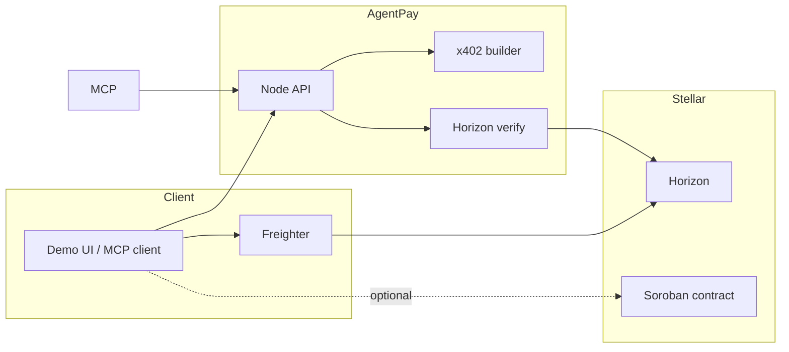

# AgentPay on Stellar

**AgentPay on Stellar** is a hackathon-grade stack for the **agentic economy**: paid agent services using **HTTP 402 / x402-style** payment challenges, **Stellar testnet** settlement (Horizon-verified native XLM in the reference path), **Freighter** signing, an optional **Soroban** registry + payer-authenticated settlement ledger, and an **MCP** server for Cursor / Claude Code.

| Layer | What it is |
|--------|------------|
| **Soroban** | `contracts/agent-pay` — agent registry, replay-safe `record_query_payment` (payer signs via Soroban auth). |
| **Payment** | `server/src/x402.ts`, `horizonVerify.ts` — payment requirement JSON + memo; verifies payments against Horizon. |
| **Agent** | Pay-per-query “search” API returning premium text after settlement (`/api/paid-search`). |
| **App** | Vite + React demo at **`/demo`** — wallet panel, timeline, x402 display, tx link. |
| **MCP** | `server/src/mcp-entry.ts` (stdio) — `list_agents`, `request_paid_search`, `check_demo_log`, `get_payment_template`, `check_contract_state`. |

## Problem

AI agents hit a hard stop at **payments**: subscriptions and API keys do not map cleanly to autonomous tools. **Micropayments + explicit authorization** align better with per-call agent workflows.

## Why Stellar

Fast testnet iteration, low fees, native **asset** payments with **explicit memos** for challenge binding, and **Soroban** for policy/metadata and payer attestation patterns that complement off-chain verification.

## Architecture



## Smart contract design

See [`contracts/agent-pay/README.md`](contracts/agent-pay/README.md).

- **Registry**: priced agent rows (name, endpoint, category, `price_stroops`, reputation).
- **Settlement ledger**: `record_query_payment` requires **`payer.require_auth()`**, enforces **`payment_ref`** uniqueness (replay protection), optional min amount vs list price, bumps reputation.

The HTTP API does **not** replace the contract: production flow is **pay on-chain → verify memo/amount on Horizon → (optional) payer invokes `record_query_proof`** for auditability.

## Payment flow (x402-style)

1. `GET /api/paid-search?q=…` → **402** + JSON `payment` (Stellar testnet destination, stroops, **memo** embedding challenge id).
2. Client builds/signs/submits **native payment** (Freighter in the demo UI; unsigned XDR from `GET /api/payment-xdr`).
3. `POST /api/paid-search` with `{ q, challenge_id, proof: { payer, tx_hash } }` → server loads challenge, **verifies** tx on Horizon (or simulated mode), returns premium “search” payload.

**Headers**: `Accept-Payment` is set on 402 responses (JSON serialized requirement).

## Setup

### Prerequisites

- Node 18+
- Rust + Wasm target + **Stellar CLI** (for contract deploy) — see Stellar docs
- **Freighter** (optional, for live path)

### 1. API server

```bash
cd server
cp .env.example .env
# Edit PAYMENT_DESTINATION (testnet) or set DEMO_SIMULATED=true
npm install
npm run dev
```

### 2. Frontend

```bash
npm install
npm run dev
# open http://localhost:8080/demo
```

Vite proxies `/api` → `http://127.0.0.1:8787`.

### 3. Soroban contract

```bash
cd contracts/agent-pay
cargo test
# deploy with stellar-cli; then set CONTRACT_ID in server/.env
```

### 4. MCP (optional)

With the API running:

```bash
cd server
AGENTPAY_API=http://127.0.0.1:8787 npm run mcp
```

Wire the command into Cursor MCP settings using **stdio** (see `GET http://localhost:8787/api/mcp` for a machine-readable hint).

## Environment variables

| Variable | Purpose |
|----------|---------|
| `PAYMENT_DESTINATION` | G-address receiving native XLM (required if `DEMO_SIMULATED` is off). |
| `QUERY_PRICE_STROOPS` | Price per query (default `100000`). |
| `DEMO_SIMULATED` | `true` skips Horizon and accepts demo hashes (judging / no XLM). |
| `CONTRACT_ID` | Optional Soroban contract (metadata / future RPC reads). |
| `AGENTPAY_API` | Base URL for MCP stdio server. |

## Demo walkthrough

1. Start **server** then **frontend**.
2. Open **`/demo`**.
3. **Simulated**: ensure `DEMO_SIMULATED=true`, click **Run demo flow** — full 402 → POST without Freighter.
4. **Testnet**: set **merchant** `PAYMENT_DESTINATION`, fund payer on testnet, connect **Freighter**, run demo — inspect tx on Stellar Expert.

## Real vs simulated

| Component | Real | Simulated |
|-----------|------|-----------|
| HTTP 402 + challenge | Yes | Yes |
| Horizon payment verify | When `DEMO_SIMULATED` unset + `PAYMENT_DESTINATION` set | Skipped |
| Freighter sign + submit | User’s browser | N/A |
| Soroban | After you deploy + call from CLI/wallet | Not auto-called from API in this MVP |

## Limitations & extensions

- **USDC path**: current reference uses **native XLM** (stroops) for a minimal Horizon verification loop; USDC would use claimable balances or classic trustline payments with issuer/asset checks.
- **MPP / sponsorship / contract accounts**: documented as natural extensions (fee sponsorship + policy accounts); not bundled here to keep the vertical slice coherent.
- **Soroban invocation from UI**: add RPC + auth entries when `CONTRACT_ID` is set; wire `record_query_payment` after Horizon success.

## Scripts

- `npm run dev` — Vite app  
- `npm run server:dev` — API + hot reload  
- `cd server && npm test` — payment requirement unit test  

## License

Apache-2.0 (match Stellar ecosystem defaults unless your org requires otherwise).
